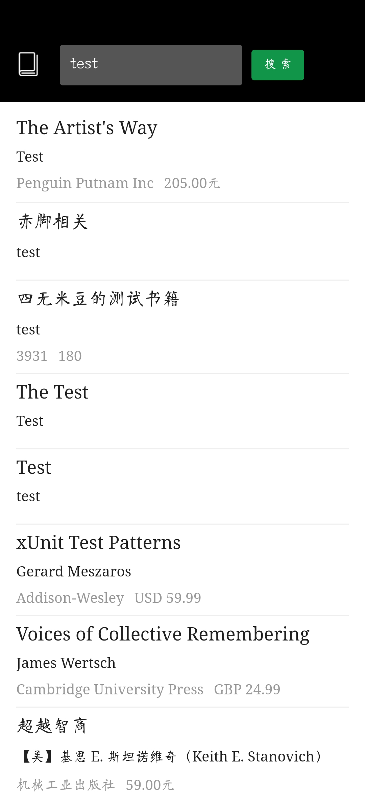
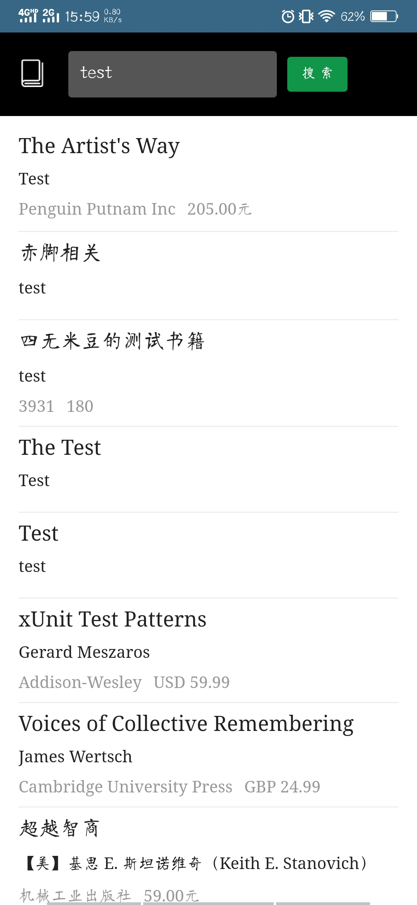
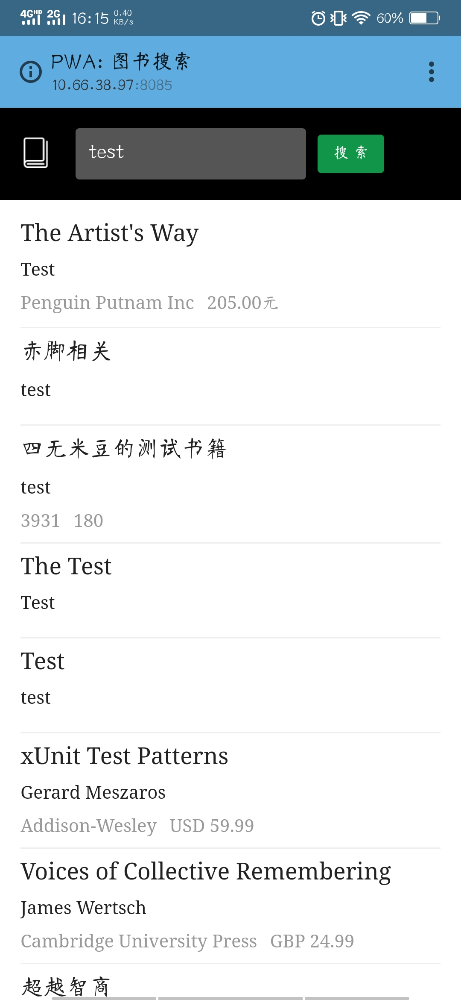
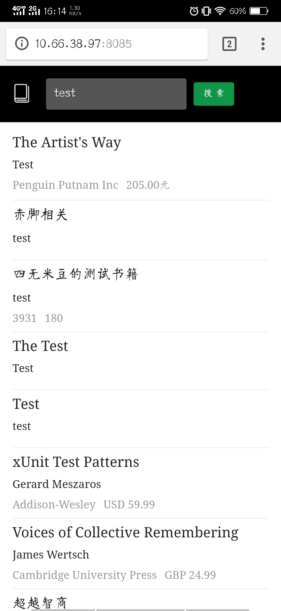

## manifest简介
- ### **name** & **short_name**
  Web App的名称。short_name为简称，当没有足够足够空间展示应用name时，系统会使用short_name
- ### **display**
  控制应用的显示模式
  - fullscreen：全屏显示，会尽可能将所有的显示区域都占满
  
  - standalone：独立应用模式，这种模式下打开的应用会有自己的启动图标，更像native app
  
  - minimal-ui：与standalone相比，该模式会多出地址栏
  
  - browser：与浏览器打开样式一致
  
- ### **start_url**
  用户打开改Web App时加载的URL。相对URL，相对于manifest文件
- ### **orientation**
  控制Web App的方向，具体可查看[文档](https://lavas.baidu.com/pwa/engage-retain-users/add-to-home-screen/introduction)
- ### **icons**
  指定应用的桌面图标。开屏图实际就是背景颜色+图标的展示模式
- ### **background_color**
  背景颜色
- ### **theme_color**
  主题颜色
- ### **description**
  应用的描述